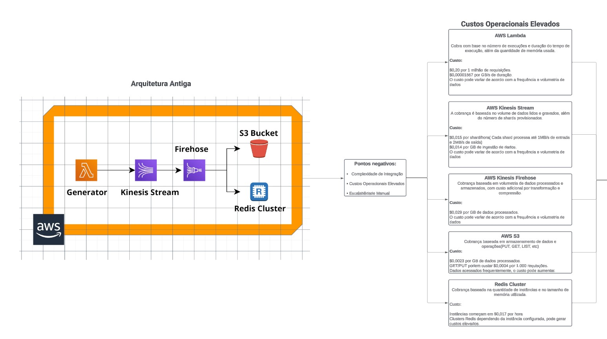

# Olá a todos!

Abaixo estão os itens com suas respectivas respostas:

## Item 1 - Sobre Storytelling e Apresentação

Aqui está o [meu vídeo de explicação](https://youtu.be/Wi1cg3hbybs).

### Arquitetura


#### Arquitetura antiga



Uma arquitetura que apresenta pontos negativos como complexidade de integração, custos elevados e escalabidade manual, o que pode ser um problema.

#### Arquitetura nova


A nova arquitura centraliza tudo na Dadosfera, utilizando através de API, pípeline e processamento próprio, mantendo apenas o envio para o S3 Bucket e ainda sendo possível a criação de dashboards.

## Item 2 - Sobre a Dadosfera

Os dados foram extraídos pelo link fornecido do dataset


Porém ao tentar subir o arquivo para a plataforma da Dadosfera, verifiquei que existe a limitação de 250 mb e aceita somente Json, CSV e Parquet:


Pensando em uma solução, elaborei um notebook jupyter para extrair os dados do URL do Dataset e salvar 150 registros em um .CSV, pensando na intenção de diminuir o tamanho do arquivo final e conseguir subir isso para a plataforma.


Com o arquivo gerado, tive exito na súbida do arquivo para a plataforma da Dadosfera.


Arquivos disponibilizados na plataforma.


## Item 3 - Sobre GenAI e LLMs

Nessa etapa era necessário gerar um novo arquivo, onde os dados obtidos do CSV fosse tratados e preparados para seguir esse modelo:


Seguindo a sugestão colocada diretamente na proposta, utilize uma LLM forncida pela própria HuggingFace que seria a plataforma responsável por hospedar o Dataset.

```python
import pandas as pd
import json
import re
from transformers import pipeline

# Caminho para o arquivo CSV e o arquivo de saída CSV
file_path = r"C:\Users\Moraes\Downloads\subset_data.csv"
output_file_path = r"C:\Users\Moraes\Downloads\products_with_features.csv"

# Carregar o modelo de perguntas e respostas da Hugging Face
qa_pipeline = pipeline("question-answering")


# Função para limpar e ajustar o campo Product Description
def clean_product_description(text):
    if not isinstance(text, str):
        return ""

    cleaned_text = re.sub(
        r"(?i)\bProduct\s*Description[:\-\—\s]*(.*)", r"\1", text
    ).strip()

    return cleaned_text


# Função para gerar features usando o modelo da Hugging Face
def generate_features_hf(title, text):
    text = clean_product_description(text)

    questions = {
        "category": "What is the category of the product?",
        "material": "What material is the product made of?",
        "receiver_design": "Describe the receiver design.",
        "hand_strap": "Does the product have a hand strap?",
        "RFID_technique": "What is the RFID technique used for?",
        "handmade": "Is the product handmade?",
        "stitching": "Describe the stitching of the product.",
        "card_slots": "Does the product have card slots?",
        "cosmetic_mirror": "Does the product have a cosmetic mirror?",
        "kickstand_function": "Does the product have a kickstand function?",
        "space_amplification": "Does the product have space amplification?",
        "color_options": "What are the color options for the product?",
        "compatibility": "What is the compatibility of the product?",
    }

    features = {}
    try:
        for key, question in questions.items():
            answer = qa_pipeline(
                question=question, context=f"Title: {title}\nDescription: {text}"
            )
            features[key] = answer["answer"]
    except Exception as e:
        features["error"] = str(e)

    return features


# Função para processar cada linha do DataFrame
def process_row(row):
    original_description = row["Product Description"]
    cleaned_description = clean_product_description(original_description)

    features = generate_features_hf(row["Titulo"], cleaned_description)

    row_data = {
        "Titulo": row["Titulo"],
        "Product Description": cleaned_description,
    }
    row_data.update(features)

    return row_data


data = pd.read_csv(file_path)
data.rename(columns={"title": "Titulo", "text": "Product Description"}, inplace=True)


processed_data = data.apply(process_row, axis=1).tolist()


processed_df = pd.DataFrame(processed_data)

processed_df.to_csv(output_file_path, index=False)

print(f"Arquivo CSV salvo como {output_file_path}.")

```

Nessa etapa além do uso da LLM para fazer a extração das perguntas com base no modelo cedido, também foi realizado uma limpeza nos dados através de um regex tendo em vista que, no campo de Product Description em alguns momentos era retornado duplicidade nos dados ficando por exemplo Product "Description: Product Description", com isso foi realizada um ajuste para ser preparado o código e higienizado para melhor atentar a precisão das necessidades dos dados.


Arquivo tratado e hospedado na plataforma da Dadosfera.

## Item 4 - Sobre SQL e Python

Nessa etapa foi necessário executar uma Query SQL dentro da plataforma da Dadosfera com o propósito de categorizar os produtos contidos no Dataset, para isso foi necessário criar uma coleção.


Então foi executado uma query para gerar um resultado para encontrarmos os valores requisitados.


Só quero deixar um comentário, que seguindo a documentação disponibilizada, não foi possível encontrar a fonte de dados diretamente na plataforma e para conseguir resolver essa situação, subi novamente o arquivo .CSV na plataforma para realizar a Query.

## Item  5 - Sobre Data Apps

